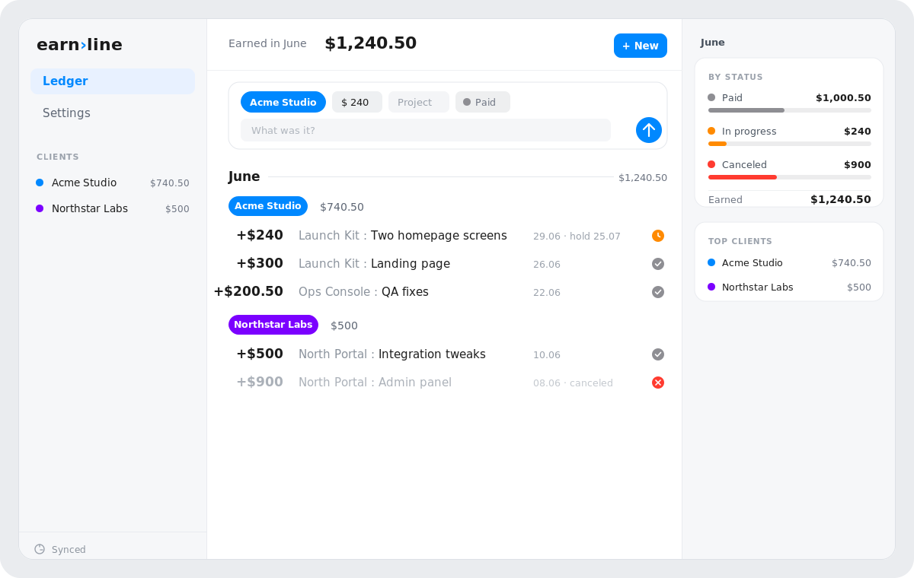

<div align="center">

# earn›line

**An income‑only notebook for freelancers, on iOS *and* the web.**

Jot income the way you'd type it in Notes. Every line is parsed into a clean, self‑totalling,
cloud‑synced ledger that stays in lock‑step across your phone and your browser.

<p>
  
  
  
  
  
  
</p>

<br>



</div>

---

## ✦ What it is

earn›line is **income‑only** by design. It is deliberately *not* a budget app, wallet, expense
tracker, or CRM. You write what you earned as plain lines, and the app understands them:

```text
+$240 Acme: 2 screens
⌛ +$140 Acme: Logotype        hold until 14.07
✅ +$300 Studio X: Landing page
```

Every line is parsed into **amount · client · project · task · date · hold‑until · status**, and
totals roll up automatically **by month, by client, and by status**.

## ✦ One ledger, two apps

| | Path | Stack |
| --- | --- | --- |
| 📱 **iOS** | [`ios-app/`](ios-app) | SwiftUI (iOS 26) · Liquid Glass · SwiftData · Supabase Swift |
| 🌐 **Web** | [`web/`](web) | React · Vite · TypeScript · Dexie (IndexedDB) · supabase‑js |
| ☁️ **Backend** | [`supabase/`](supabase) | Shared Postgres schema + migrations |

Both clients are **peers** of one Supabase project, so a line added on the phone shows up in the
browser and vice‑versa. They differ only in presentation: the iOS app is a phone‑native SwiftUI
experience, and the web app is **desktop‑first**, with its own web‑native design system (sidebar ·
ledger · summary rail). The data model, sync engine, and wire format are shared.

<div align="center">
<table>
  <tr>
    <td></td>
    <td></td>
  </tr>
  <tr>
    <td align="center"><b>Native on iOS</b><br><sub>Liquid Glass · months · color‑coded statuses</sub></td>
    <td align="center"><b>The smart composer</b><br><sub>type → chips → commit</sub></td>
  </tr>
</table>
</div>

## ✦ Full synchronization

There is no separate server. Sync is a small set of conventions over four Postgres tables
(`earnline_clients`, `earnline_entries`, `earnline_headings`, `earnline_tombstones`), scoped by a
`workspace_id`:

- **Personal, no‑login** — both clients connect with the project's *publishable* key and a shared
  workspace ID (entered in each app's Settings). No accounts.
- **Offline‑first on both platforms** — iOS uses SwiftData, web uses Dexie / IndexedDB. Edits apply
  instantly and queue for sync.
- **Last‑write‑wins** on `updated_at`, with **tombstones** so deletes propagate.
- **Live** — the web app also subscribes to Supabase Realtime, so remote changes appear without a
  manual refresh.

> [!NOTE]
> The publishable / anon key is client‑safe; the `workspace_id` is the only access gate and is a
> low‑security personal‑sharing identifier. Never put a `service_role` key in either app.

## ✦ Repository layout

```
earnline/
├─ ios-app/    SwiftUI app    · Models · Parsing · Theme · Sync · ViewModels · Views · Tests
├─ web/        React + Vite   · domain · data · sync · state · ui (screens + components + theme)
├─ supabase/   shared Postgres schema + migrations
├─ docs/       screenshots
└─ .github/    CI workflow + CODEOWNERS
```

Review ownership is declared in [`.github/CODEOWNERS`](.github/CODEOWNERS), and
[`CONTRIBUTING.md`](CONTRIBUTING.md) documents the wire‑format contract both apps must uphold.

## ✦ Get started

**🌐 Web**

```bash
cd web
npm install
npm run dev            # http://localhost:5173
```

No Supabase yet? Open **Settings → Import sample ledger** for the same demo data as iOS.

**📱 iOS**

```bash
cd ios-app
xcodegen generate      # regenerate earnline.xcodeproj
open earnline.xcodeproj
```

**☁️ Backend** — apply [`supabase/earnline_sync_schema.sql`](supabase/earnline_sync_schema.sql) to
your Supabase project, replacing `your-workspace-id` with a private identifier, then enter the
project URL, publishable key, and that workspace ID in each app's Settings.

## ✦ CI

[`.github/workflows/ci.yml`](.github/workflows/ci.yml) runs two jobs on every pull request: the
**iOS** job regenerates the project with XcodeGen and runs `xcodebuild test`, and the **web** job
runs the Vitest suite and a production build.

## ✦ Contributing & license

Contributions are welcome. See [`CONTRIBUTING.md`](CONTRIBUTING.md) for the monorepo layout and the
one rule that keeps both apps in sync. Released under the [MIT License](LICENSE).

<div align="center"><sub>Built with SwiftUI, React, and one shared wire format. ✦</sub></div>
