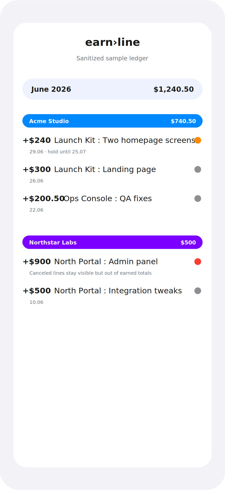
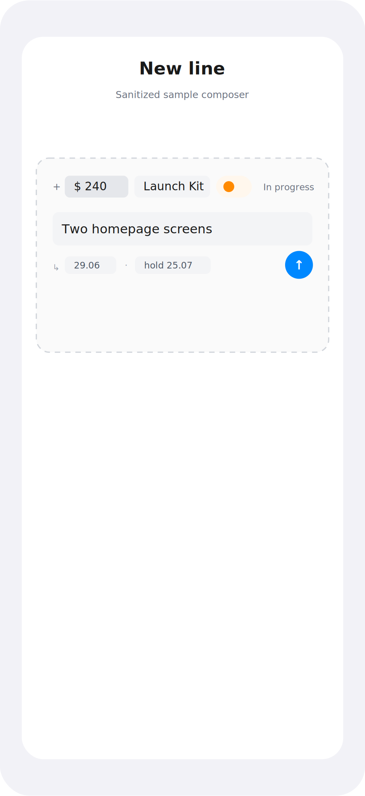

<div align="center">

# earn›line

**An income‑only notebook for freelancers.**
Jot income the way you'd type it in Notes — earn›line parses every line into a clean, self‑totalling, cloud‑synced ledger.

<br>


<br>

<table>
  <tr>
    <td></td>
    <td></td>
  </tr>
  <tr>
    <td align="center"><b>The ledger</b><br><sub>months · clients · color‑coded statuses</sub></td>
    <td align="center"><b>The composer</b><br><sub>type → chips → commit</sub></td>
  </tr>
</table>

</div>

---

## ✦ What it is

earn›line is **income‑only** — deliberately *not* a budget app, wallet, expense tracker, or CRM. You write what you earned as plain lines, and the app understands them:

```
+$240 Acme: 2 screens
⌛ +$140 Acme: Logotype hold until 14.07
✅ +$300 Studio X: Landing page
```

Every line is parsed into **amount · client · project · task · date · hold‑until · status**, and totals roll up automatically **by month, by client, and by status**.

## ✦ Highlights

- 💬 **Smart composer** — build a line token by token: type the amount, **Return** → project, **Return** → task, **Return** commits. The project chip lets you **pick an existing project or type a new one**; the date and hold‑until open as anchored **popover tooltips**. The whole card animates open as its own row beneath the client.
- 🟢 **Three calm statuses** — most income you add is *already paid*, so **Paid** is the unremarkable gray default. Lines that still need work show **In progress** (orange), and ones that fell through show **Canceled** (red).
- 🔢 **Rolling totals** — the summary total animates with an odometer‑style numeric roll as the displayed month changes under your scroll.
- 📐 **Responsive client rows** — the running total always keeps the **main currency full‑size**; when space is tight it drops the secondary currency, then collapses **+ Line** to a single **+**.
- 🗓 **Continuous month scroll** — every month is one list separated by dividers (each with its subtotal); the summary pill tracks the top‑most visible month.
- ✋ **Rich line actions** — **press‑and‑hold** for a solid preview card with Edit, a Status picker, and Delete; **swipe** for Edit / Delete. Deleting always asks for confirmation.
- 💱 **Dual currency** — write in a primary currency, see a secondary converted value at an editable rate.
- ☁️ **No‑login cloud sync** — personal Supabase workspace sync with dirty‑row push, pull, and offline delete tombstones.

## ✦ Design language — Liquid Glass

Native iOS built in Apple's **Liquid Glass** system (iOS 26): real glass materials (`glassEffect`, `GlassEffectContainer`, `buttonStyle(.glass)`), soft scroll‑edge effects, spring micro‑interactions, SF Pro typography, a calm palette, and haptics. The Figma is the source of truth — the UI mirrors it rather than reinventing it.

## ✦ Tech stack

| Layer | What |
| --- | --- |
| **UI** | SwiftUI (iOS 26) · Liquid Glass APIs |
| **Persistence** | SwiftData (`Client`, `Entry`, `Heading`) + sync tombstones |
| **State** | `@Observable` `AppModel` · `UserDefaults` currency settings |
| **Parsing** | custom, unit‑tested `LineParser` (amounts, currencies, hold dates, status marks) |
| **Sync** | Supabase Swift · personal no‑login workspace · pinned via XcodeGen |
| **Project** | generated from `project.yml` with [XcodeGen](https://github.com/yonaskolb/XcodeGen) |

## ✦ Project structure

```
earnline/
  Models/      Client, Entry, EntryStatus, Heading, SyncState   (SwiftData)
  Parsing/     LineParser, ParsedLine
  Theme/       Theme tokens, Color+Hex, CurrencyFormatter, DateFormat
  Sync/        SyncCoordinator, RemoteRecords, SupabaseProjectDefaults
  ViewModels/  AppModel  (state, currency, grouping & totals)
  Views/       LedgerView · SummaryPill · ClientChip · EntryRow · SmartComposer
               MonthDivider · NewClientSheet · ClientDetailView · EditEntrySheet
               SettingsView · EmptyStateView · GlassButtons
  Util/        SampleData, IncomeLedgerImporter, Validation, DeterministicID, FlowLayout
earnlineTests/ LineParserTests, ValidationTests
supabase/      schema + migrations
```

## ✦ Build & run

```bash
xcodegen generate                                   # regenerate earnline.xcodeproj from project.yml
xcodebuild -scheme earnline \
  -destination 'platform=iOS Simulator,name=iPhone 17 Pro,OS=26.5' build
xcodebuild -scheme earnline \
  -destination 'platform=iOS Simulator,name=iPhone 17 Pro,OS=26.5' test
```

Open `earnline.xcodeproj` in **Xcode 26** and run on an **iOS 26** simulator. Launch arg `-demoComposer` opens the composer pre‑filled for the first client (handy for screenshots).

## ✦ Supabase

The app keeps the personal **no-login** sync model: Settings stores a Supabase project URL, publishable key, and workspace ID locally in `UserDefaults`. The tracked source contains placeholders only. Never paste a `service_role` key into the app.

SQL history lives in [`supabase/migrations`](supabase/migrations), with a one-shot current schema at [`supabase/earnline_sync_schema.sql`](supabase/earnline_sync_schema.sql). Before applying the example schema to your own project, replace `your-workspace-id` with a private workspace identifier and keep that value out of public screenshots.

## ✦ CI

The GitHub Actions workflow in [`.github/workflows/ci.yml`](.github/workflows/ci.yml) regenerates the project with XcodeGen and runs `xcodebuild test` with signing disabled.

## ✦ Status

**v0.0.1** — first tagged build: the income ledger, smart composer, redesigned statuses, rolling totals, responsive rows, confirmation‑guarded deletes, and personal Supabase sync.

<div align="center"><sub>Built with SwiftUI, SwiftData, and a lot of glass. ✦</sub></div>
