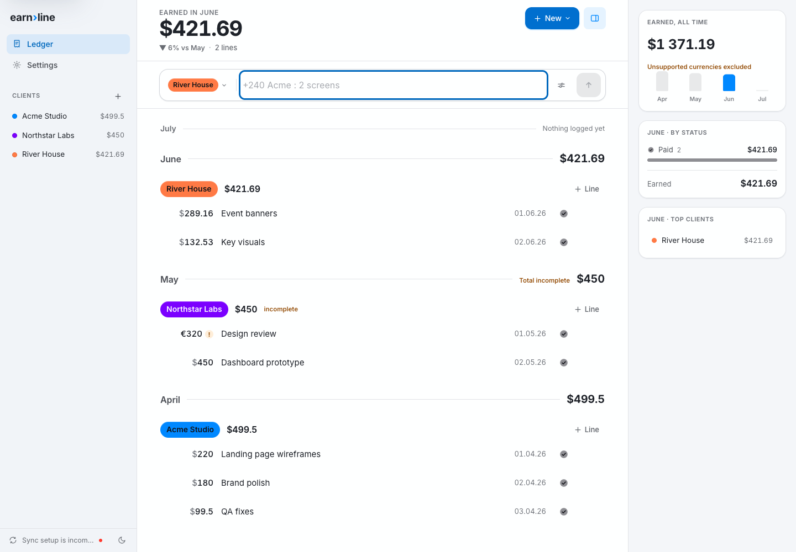
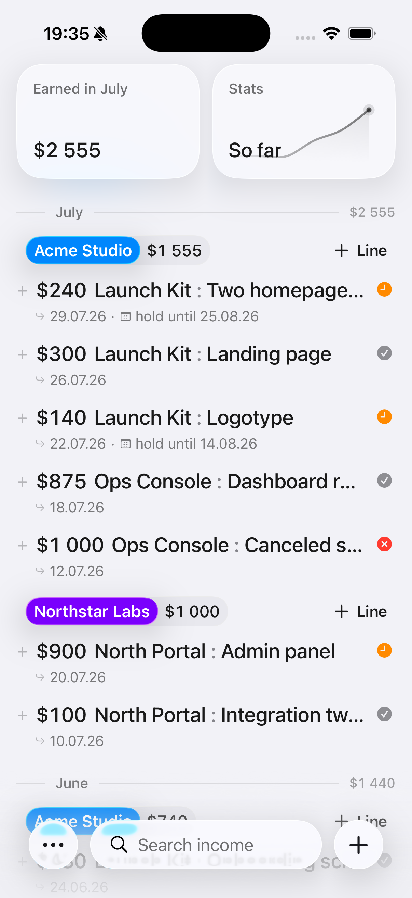
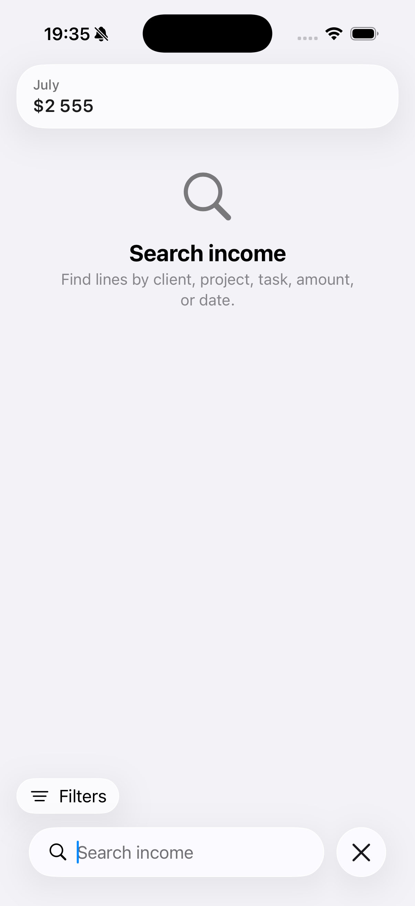
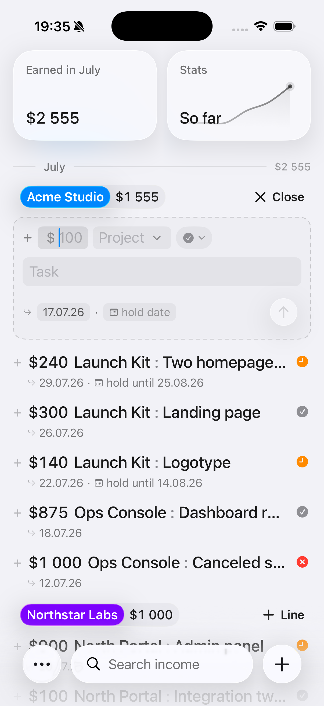
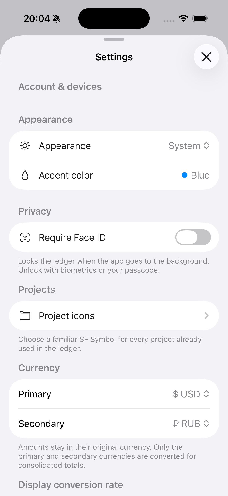
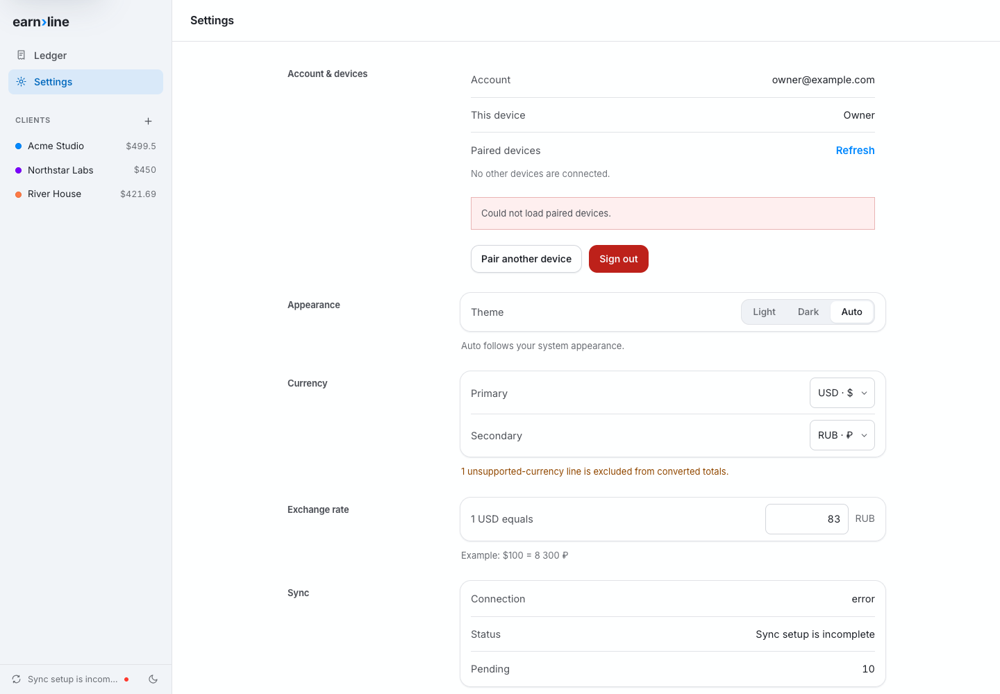

# earn›line

An income ledger for independent work. Write a line, keep the useful details,
and see the month clearly on iPhone or on the web.



## A quiet place for earned work

- Capture an amount, client, project, task, date, and payment state in one
  compact line.
- Keep working when offline. Each app stores its ledger locally first.
- Search by words or native iOS filter tokens for date, client, project, and
  status.
- Use the same private workspace on iOS and web when you choose to sign in and
  connect it.

## Built for the two places you work

The iOS app is a native SwiftUI ledger with a composer, contextual menus, and
an iPhone-first layout.

| Ledger | Native filters | Composer |
| --- | --- | --- |
|  |  |  |



The web app is desktop-first: sidebar, ledger, and a summary rail stay visible
without imitating a phone UI.

## Local first, private when connected

Local data is immediately usable, so a weak connection does not interrupt a
workday. When a private workspace is connected, the iOS and web apps synchronize
only that workspace. Account and device settings make the current state visible.



All screenshots in this README are captured from the running apps with
fictional disposable sample data. They contain no customer records, credentials,
or stock/mockup artwork.

## Run it locally

```bash
# Web
cd web && npm ci && npm run dev

# iOS
cd ios-app && xcodegen generate
open earnline.xcodeproj
```

The repository contains the iOS app, web app, and Supabase backend side by side.
Each directory has a short README for its own local workflow.

## License

[MIT](LICENSE)
